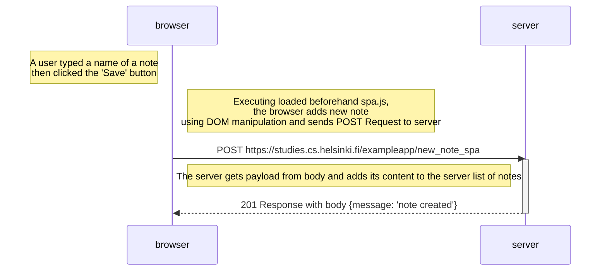

```mermaid
	sequenceDiagram
		participant browser
		participant server

		Note left of browser: A user typed a name of a note <br/> then clicked the 'Save' button
		Note right of browser: Executing loaded beforehand spa.js, <br/>the browser adds new note <br/>using DOM manipulation and sends POST Request to server

		browser->>server: POST https://studies.cs.helsinki.fi/exampleapp/new_note_spa
		activate server
		Note left of server: The server gets payload from body and adds its content to the server list of notes
		server-->>browser: 201 Response with body {message: 'note created'}
		deactivate server
		
```